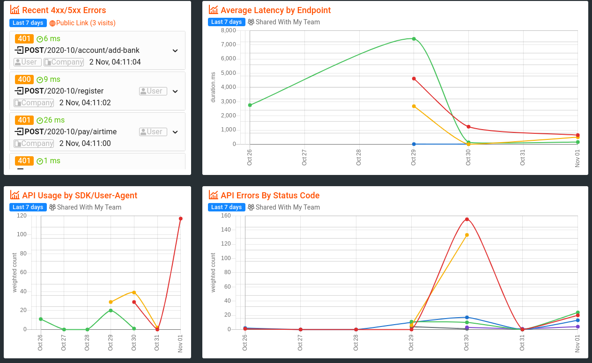

# EffesEYE Backend (monolith)

 

The EffesEYE backend is a monolithic NodeJS/Express application, implemented as a simple REST service, in compliance with the EffesEYE platform APIs specified at [http://effeseye-api.netlify.com](http://effeseye-api.netlify.com)

See more analytics info on our [Moesif dashboard](https://www.moesif.com/wrap/app/88:648-487:154/dash/5f8ad9001d56ae3e1eb2f75c)

## Usage

### Functional (Limited) Usage

> covers mostly admin functionality

1.   Go to [https://effeseye-admin.netlify.app/](https://effeseye-admin.netlify.app/)
2.  Login with username: `chaluwa@gmail.com` and password: `pa55W0rd`
3.  Use the `People` and `Payments` navigation links to go around and see existing users and payments made so far. These would be mostly data seaded into the database
4.  See next section for how to register and make payments

### Full Usage

> covers all currently supported functionality

1.  clone the repo: `git clone git@github.com:EffesEYE/backend-monolith.git`
2.  cd into the repo folder: `cd backend-monolith`
3.  run `npm install`. Requires working Nodejs and npm installations
4.  run `npm serve:devmode` to start the local Node/Express server on port `8181`
5.  Open the project in VSCode and install the [REST Client](https://marketplace.visualstudio.com/items?itemName=humao.rest-client) extension
6.  Open the `effeseye.rest` file in the root of the project folder and follow the documented steps
    *   you will be able to register new users, login as a user or admin, and make payments
    *   you can occasionally log into the EffesEYE [Admin app](https://effeseye-admin.netlify.app/) to see that your interactions are properly registered and visible 

## Currently Unmet Requirements/Expectations

1.  Use of TypeScript. This project is currently built with vanila Javascript and can be progressively migrated to TypeScript
2.  Support for SOAP. This can be added as an additional communication / transport interface, but we currently only implemented REST/JSON
3.  There's no support for deleting records.

## Tests & Coverage Reporting

Tests are location in the `./tests` folder. While currently not exhaustive (not every API endpoint has a test), we've managed to hit a high test coverage (over 90%) by test the endpoints that are of more value to users, and they coincidentally have the most code execution path.

Tests were ran locally against a PostgresSQL database (needed to cut down latency) and the `--coverage` flag for Jest reports coverage for our tests. The coverage files in `./tests/coverage` are then used by the `make-coverage-badge` npm module to generate a coverage badge which we have displayed galantly in this README file.

## There's More

See [here](https://github.com/EffesEYE/about) for a more complete exploration of the entire EffesEYE platform, including architecture, technology stack, security, performance, and some potentially valuable refelctioins.

